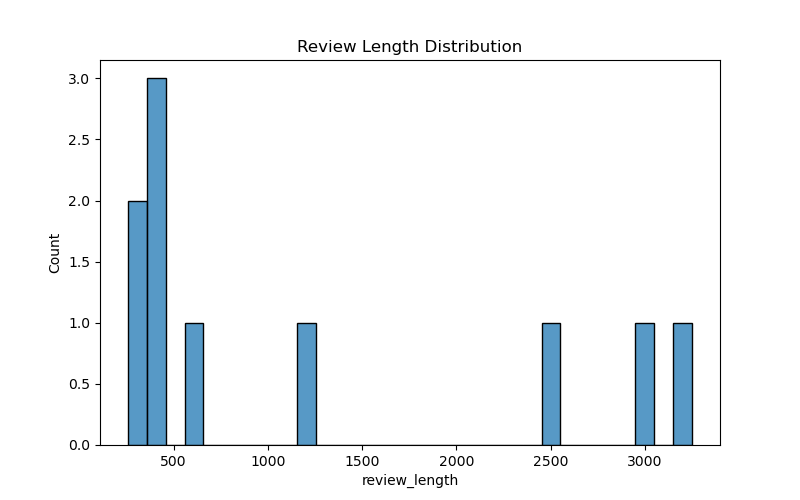
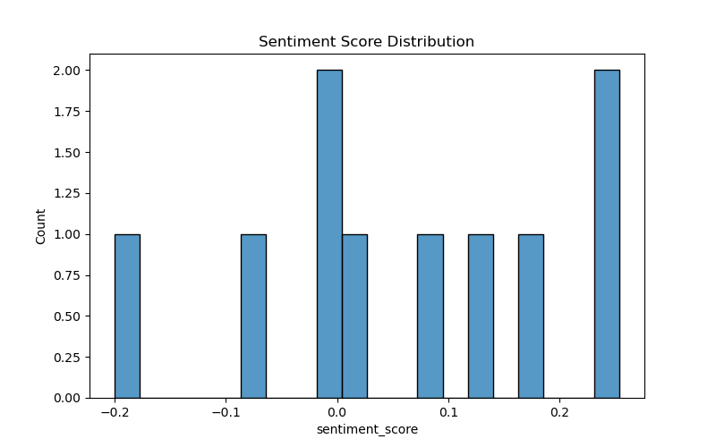
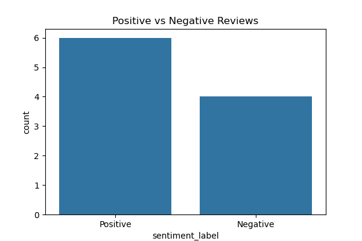
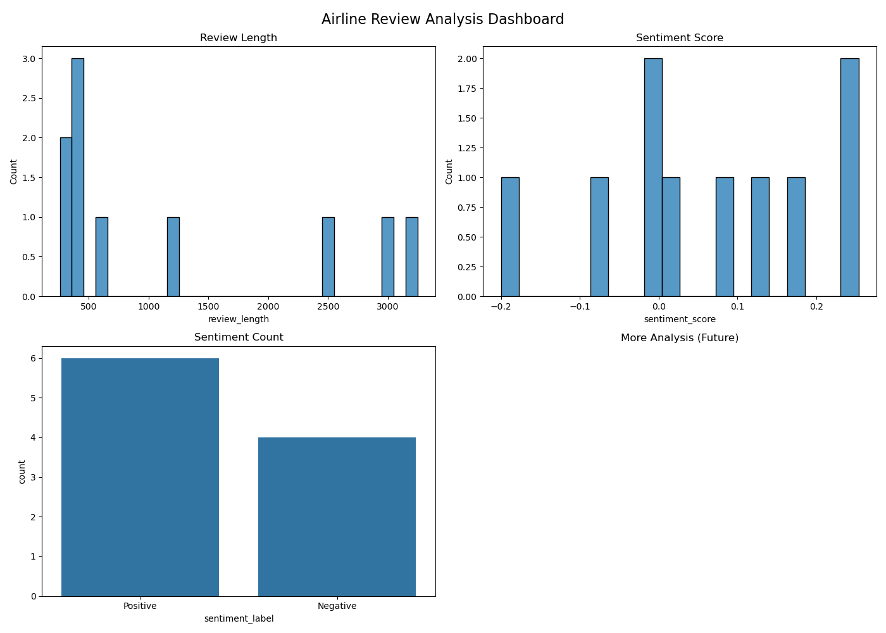

# ✈️ Airline Service Quality Analysis

## 📌 Project Overview

This project performs **airline service quality analysis** using customer reviews.
It includes web scraping, data cleaning, sentiment analysis, and data visualization to understand customer satisfaction trends.

The objective of this project is to analyze airline passenger feedback and extract meaningful insights about service quality and customer experience.

---

## 🚀 Features

* 🌐 Web scraping of airline customer reviews
* 🧹 Data cleaning and preprocessing
* 😊 Sentiment analysis of reviews
* 📊 Data visualization dashboard
* 📁 CSV data storage and processing
* 📈 Customer satisfaction insights

---

## 🛠 Tech Stack

* Python
* Pandas
* BeautifulSoup
* Requests
* Matplotlib
* Seaborn
* Jupyter Notebook

---

## 📂 Project Structure

```
Airline-Service-Quality-Analysis/
│
├── data/
│   ├── reviews.csv
│   └── cleaned_reviews.csv
│
├── notebooks/
│   └── data_analysis.ipynb
│
├── visualizations/
│   ├── review_length.png
│   ├── sentiment_score.png
│   ├── sentiment_count.png
│   └── dashboard.png
│
├── scraping.py
└── README.md
```

---

## 📊 Data Analysis Workflow

1. Scraped airline review data from website.
2. Stored data in CSV format.
3. Cleaned and processed text data.
4. Calculated review length and sentiment score.
5. Generated visual insights.
6. Created dashboard visualization.

---

## 📈 Visualizations

The following visualizations provide insights into airline customer reviews and service quality.

---

### 📌 Review Length Distribution

This graph shows how long customer reviews are and helps understand the level of detail in passenger feedback.



---

### 📌 Sentiment Score Distribution

This visualization shows the distribution of sentiment scores extracted from customer reviews.

* Higher score → Positive experience
* Lower score → Negative experience



---

### 📌 Positive vs Negative Reviews

This chart compares the number of positive and negative customer reviews to measure overall customer satisfaction.



---

### 📌 Analysis Dashboard

This dashboard combines all visual insights into a single view:

* Review length distribution
* Sentiment trends
* Customer satisfaction summary



---

## ▶️ How to Run Project

### Install dependencies

```
pip install requests beautifulsoup4 pandas matplotlib seaborn
```

### Run web scraping

```
python scraping.py
```

### Run analysis notebook

```
jupyter notebook
```

---

## 🎯 Key Insights

* Customer sentiment trends from airline reviews
* Distribution of review lengths
* Positive vs negative feedback comparison
* Overall service quality analysis

---

## 👨‍💻 Author

**Sahil Shrivas**

---

## ⭐ Support

If you like this project, please give it a ⭐ on GitHub.
